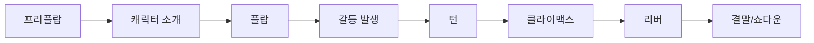

# 🔄 일반 프로덕션 → 포커 프로덕션 전환 가이드
## "Your Production Skills + Poker Knowledge = Global Career"

---

## 🎯 당신이 이미 가진 강점

### ✅ 바로 활용 가능한 기술 (Transfer Skills)
| 일반 프로덕션 경험 | 포커 프로덕션 적용 | 시너지 효과 |
|---|---|---|
| **멀티 카메라 스위칭** | FR7 시스템 8대 운영 | 플레이어 리액션 포착력 극대화 |
| **라이브 방송 운영** | 12시간+ 장시간 생중계 | 체력과 집중력 즉시 활용 |
| **그래픽/자막 제작** | 실시간 핸드 정보 표시 | 데이터 시각화 능력 확장 |
| **스토리텔링** | 토너먼트 내러티브 구축 | 드라마틱한 순간 연출 강화 |
| **위기 대응 능력** | 기술 문제 즉각 해결 | 24/7 방송 안정성 확보 |

---

## 🎓 새롭게 배워야 할 포커 특화 지식

### 📚 Week 1-2: Poker Fundamentals

#### **Day 1-3: 게임의 기초**
```
✓ 텍사스 홀덤 룰 마스터
  - 프리플랍 → 플랍 → 턴 → 리버
  - 베팅 라운드와 액션 순서
  - 핸드 랭킹 (로열 플러시 ~ 하이 카드)

✓ 실습: GGPoker 플레이머니로 100핸드 플레이
```

#### **Day 4-5: 포지션과 전략**
```
✓ 포지션의 중요성
  - EP (Early Position): UTG, UTG+1
  - MP (Middle Position): MP1, MP2
  - LP (Late Position): CO, BTN
  - Blinds: SB, BB

✓ 왜 방송에서 중요한가?
  → 포지션에 따른 플레이어 액션 예측
  → 스토리 전개 예상 가능
```

#### **Day 6-7: 베팅 패턴 읽기**
```
✓ 베팅 사이즈의 의미
  - 1/3 pot: 약한 베팅, 정보 수집
  - 2/3 pot: 표준 벨류/블러프
  - Full pot+: 강한 압박, 올인 유도

✓ 방송 활용법
  → "큰 팟이 만들어지고 있습니다!"
  → 긴장감 조성 타이밍 파악
```

---

## 🎬 포커 프로덕션만의 특별한 연출법

### 1. **"핸드 스토리텔링 프레임워크"**



#### 실제 적용 예시:
```
프리플랍: "칩 리더 John이 포켓 에이스를 들었습니다!"
플랍: "위험한 플랍! 9-10-J 투톤 보드!"
턴: "플러시 드로우 완성! 긴장감이 최고조입니다!"
리버: "믿을 수 없는 역전! 풀하우스!"
```

### 2. **"버블 타임 특별 연출"** 🫧

| 상황 | 카메라 워크 | 그래픽 | 음향 효과 |
|---|---|---|---|
| **10명 남음** | 와이드 샷 증가 | 카운트다운 표시 | 긴장감 BGM |
| **5명 남음** | 숏스택 클로즈업 | 스택 사이즈 강조 | 심장박동 효과 |
| **버블 버스트** | 슬로모션 리플레이 | 폭죽 애니메이션 | 축하 팡파레 |

---

## 💡 일반 방송 vs 포커 방송 차이점

### **스포츠 중계와의 차이**
| 구분 | 스포츠 중계 | 포커 방송 | 전환 팁 |
|---|---|---|---|
| **경기 시간** | 정해진 시간 | 무제한 | 체력 관리 필수 |
| **클라이맥스** | 예측 가능 | 매 핸드가 클라이맥스 | 항상 준비 상태 |
| **정보 표시** | 스코어 중심 | 확률/통계 중심 | 수학적 이해 필요 |
| **카메라 워크** | 액션 추적 | 표정/칩 추적 | 디테일 포커싱 |

### **예능/쇼 프로그램과의 차이**
| 구분 | 예능 방송 | 포커 방송 | 전환 팁 |
|---|---|---|---|
| **대본** | 사전 기획 | 실시간 전개 | 즉흥 대응력 |
| **출연자** | 엔터테이너 | 일반인+프로 | 다양성 이해 |
| **편집** | 후반 작업 중심 | 실시간 편집 | 빠른 판단력 |
| **시청층** | 대중적 | 마니아+일반 | 이중 타겟 전략 |

---

## 🛠️ 기술적 전환 가이드

### **RFID 시스템 마스터하기**
```python
# 일반 카메라 시스템
camera_setup = {
    "cameras": 3-5대,
    "switching": "수동",
    "delay": "없음"
}

# RFID 포커 시스템
poker_setup = {
    "cameras": 10-12대,
    "rfid_readers": 9개,
    "switching": "반자동",
    "delay": "30초",  # 홀카드 보호
    "backup": "필수"
}
```

### **30초 딜레이 활용법**
1. **실시간 분석**: 핸드 진행 상황 파악
2. **스토리 준비**: 내레이션 포인트 정리
3. **하이라이트 마킹**: 중요 순간 즉시 표시
4. **백업 체크**: 기술 문제 사전 확인

---

## 📊 성공적인 전환을 위한 4주 로드맵

### **Week 1: Foundation**
- [ ] 포커 룰 100% 이해
- [ ] GGPoker에서 500핸드 플레이
- [ ] WSOP 방송 10시간 시청
- [ ] 포커 용어 100개 암기

### **Week 2: Integration**
- [ ] 모의 토너먼트 참여
- [ ] 선배와 함께 방송 참관
- [ ] 핸드 분석 리포트 작성
- [ ] 카메라 포지션 실습

### **Week 3: Practice**
- [ ] 보조 PD로 방송 참여
- [ ] 하이라이트 편집 5개
- [ ] 실시간 큐시트 작성
- [ ] 위기 상황 시뮬레이션

### **Week 4: Evaluation**
- [ ] 독립 방송 운영 (2시간)
- [ ] 피드백 반영 개선
- [ ] 최종 평가 테스트
- [ ] 정식 배치 결정

---

## 🎯 Quick Win 전략

### **첫 주에 바로 할 수 있는 것들**
1. **카메라 앵글 최적화**: 기존 경험 100% 활용
2. **스위칭 리듬 개선**: 스포츠 중계 감각 적용
3. **그래픽 템플릿 제작**: 디자인 능력 발휘

### **차별화 포인트 만들기**
```
당신의 강점 + 포커 = 유니크 밸류

예시:
- 스포츠 PD 출신 → "액션 중심 다이나믹 포커 방송"
- 예능 PD 출신 → "스토리 중심 드라마틱 포커 방송"
- 뉴스 PD 출신 → "분석 중심 전략적 포커 방송"
```

---

## 💰 포커 프로덕션 커리어의 가치

### **글로벌 커리어 기회**
```
일반 방송 PD: 국내 한정
포커 방송 PD: 전 세계 이벤트

- Las Vegas (WSOP)
- Monaco (EPT)
- Macau (APPT)
- Online (GGPoker)
```

### **연봉 및 인센티브**
| 레벨 | 일반 방송 | 포커 방송 | 특별 보너스 |
|---|---|---|---|
| Junior | 3,500만원 | 4,000만원 | 이벤트 수당 |
| Senior | 5,000만원 | 6,500만원 | 해외 출장비 |
| Lead | 7,000만원 | 9,000만원 | 성과급 |

---

## 🚨 주의사항 및 함정 피하기

### **초보자가 자주 하는 실수**
1. ❌ **모든 핸드를 중요하게 다루기**
   ✅ 선택과 집중, 스토리가 있는 핸드만

2. ❌ **복잡한 전략 설명에 집중**
   ✅ 초보자도 이해할 수 있는 쉬운 설명

3. ❌ **칩 카운트만 강조**
   ✅ 플레이어 스토리와 심리전 부각

4. ❌ **30초 딜레이 잊어버리기**
   ✅ 항상 실시간이 아님을 인지

---

## 🎓 추천 학습 리소스

### **필수 시청 콘텐츠**
1. WSOP 2023 Main Event Final Table
2. Triton Poker Series (하이롤러 게임)
3. GGPoker Super Million$

### **필독서**
- "Harrington on Hold'em" - 토너먼트 전략
- "The Mental Game of Poker" - 심리적 측면
- "Applications of No-Limit Hold'em" - 수학적 접근

### **온라인 코스**
- MasterClass: Daniel Negreanu
- PokerCoaching.com: Jonathan Little
- Run It Once: Phil Galfond

---

## 🤝 멘토링 & 네트워킹

### **사내 멘토 매칭**
```
당신의 배경 → 최적의 멘토

- 스포츠 중계 → Leo.Shin (연출&제작)
- 예능/쇼 → Denny.Kim (편집)
- 뉴스/시사 → David.Kim (프로덕션)
- 온라인 → Hazel.Kim (PM)
```

### **외부 네트워크**
- Hendon Mob Database 등록
- 포커 커뮤니티 참여
- 선수들과의 관계 구축

---

## ⚡ 첫 방송을 위한 체크리스트

### **D-7: 일주일 전**
- [ ] 포커 룰 테스트 통과
- [ ] 장비 위치 숙지
- [ ] 팀원 역할 이해

### **D-1: 하루 전**
- [ ] 큐시트 리뷰
- [ ] 백업 플랜 확인
- [ ] 멘탈 준비

### **D-Day: 방송 당일**
- [ ] 장비 체크 (2시간 전)
- [ ] 팀 브리핑 (1시간 전)
- [ ] 딜레이 설정 확인 (30분 전)
- [ ] 방송 시작!

---

## 🎊 환영합니다!

> "당신의 프로덕션 전문성과 우리의 포커 노하우가 만나면,
> 세계 최고의 포커 방송이 탄생합니다."
>
> **Welcome to GG Production Family! 🎰**

---

### 📞 긴급 지원 연락처
- **기술 지원**: tech@ggproduction.com
- **교육 문의**: training@ggproduction.com
- **24/7 핫라인**: +82-10-GGPROD-11