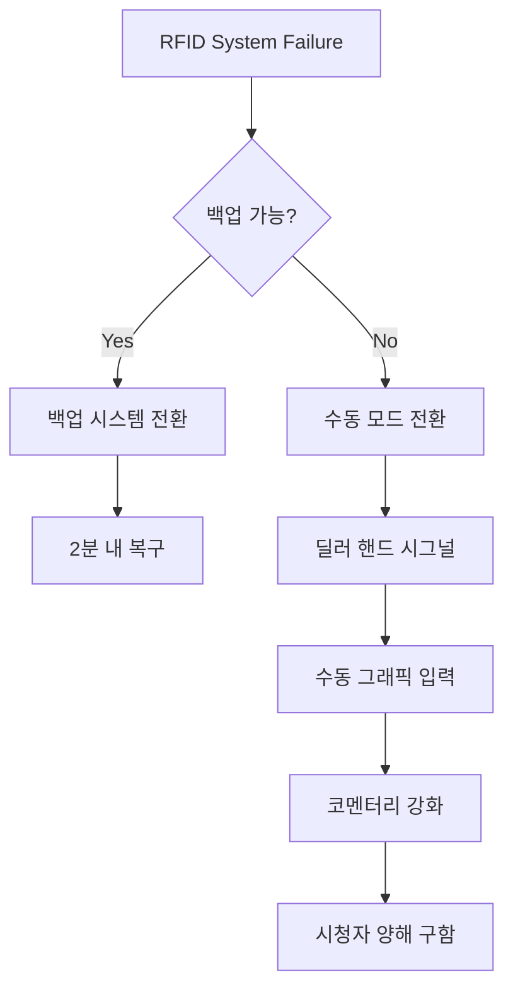

# 🚨 포커 프로덕션 위기 관리 완벽 가이드
## "Every Crisis is an Opportunity for Excellence"

---

## 🎯 위기 관리 골든 룰

### **3C 원칙**
```
1. Calm (침착): 패닉은 전염된다
2. Communicate (소통): 투명한 정보 공유
3. Continue (지속): 방송은 계속되어야 한다
```

---

## 📊 위기 레벨 분류 시스템

### **Level System**
```yaml
LEVEL 1 (Green) - Minor Issue:
- 영향: 최소
- 대응: 개인 해결
- 보고: 사후 보고
- 예시: 카메라 1대 일시 정지

LEVEL 2 (Yellow) - Moderate Issue:
- 영향: 부분적
- 대응: 팀 협업
- 보고: 즉시 보고
- 예시: RFID 부분 오류

LEVEL 3 (Orange) - Major Issue:
- 영향: 전체
- 대응: 긴급 대책반
- 보고: 경영진 보고
- 예시: 메인 스트림 중단

LEVEL 4 (Red) - Critical Crisis:
- 영향: 비즈니스 위협
- 대응: 전사 대응
- 보고: CEO 직보
- 예시: 보안 침해, 부정행위
```

---

## 🔧 기술적 위기 대응

### **Case 1: 완전 정전 (Total Blackout)**
```markdown
⏰ 발생 즉시 (0-30초)
1. UPS 자동 전환 확인
2. 백업 전원 가동
3. 최소 시스템 유지

⏰ 30초-2분
1. 비상 조명 점등
2. 노트북 기반 임시 송출
3. 모바일 핫스팟 활용

⏰ 2-5분
1. 발전기 가동
2. 순차적 시스템 복구
3. 정상 송출 재개

📢 시청자 안내:
"기술적 문제를 해결 중입니다.
 잠시 후 정상 방송하겠습니다.
 모바일 백업 스트림: [링크]"
```

### **Case 2: 인터넷 완전 단절**
```python
def internet_failure_protocol():
    # Phase 1: Immediate (0-1분)
    switch_to_4G_backup()
    reduce_stream_quality_to_720p()
    pause_secondary_streams()

    # Phase 2: Short-term (1-5분)
    if not connection_restored():
        activate_satellite_backup()
        notify_viewers_quality_reduction()

    # Phase 3: Long-term (5분+)
    implement_local_recording()
    prepare_delayed_upload()
    coordinate_with_ISP()

    return "Stream maintained at reduced quality"
```

### **Case 3: RFID 전체 시스템 다운**


---

## 👥 인적 위기 관리

### **Case 4: 핵심 인력 급작스런 부재**

| 부재 인력 | 즉시 대응 | 백업 계획 | 장기 대책 |
|---|---|---|---|
| **메인 PD** | 서브 PD 승격 | 원격 지휘 체계 | 크로스 트레이닝 |
| **스위처** | 백업 스위처 투입 | 단순화 모드 | 2인 1조 체계 |
| **RFID 담당** | 기술팀 전환 | 수동 입력 | 멀티 스킬 교육 |
| **카메라맨** | 고정 샷 증가 | PTZ 카메라 활용 | 로테이션 확대 |

### **Case 5: 의료 응급상황**
```
🚨 MEDICAL EMERGENCY PROTOCOL

1. IMMEDIATE (0-30초)
   □ 의료진 호출 (내선 911)
   □ 현장 안정화
   □ 방송 계속 진행

2. RESPONSE (30초-2분)
   □ 의료팀 도착
   □ 환자 이송 준비
   □ 대체 인력 배치

3. FOLLOW-UP (2분+)
   □ 가족 연락
   □ 병원 이송
   □ 사고 보고서 작성

⚠️ 절대 방송에 노출시키지 않음
```

---

## 🎰 게임 관련 위기

### **Case 6: 의심스러운 플레이 (Suspected Cheating)**
```yaml
탐지 신호:
- 비정상적 베팅 패턴
- 시그널링 의심
- 전자기기 사용
- 칩 조작

즉시 조치:
1. 해당 테이블 집중 감시
2. 모든 각도 녹화
3. 플로어 매니저 통보
4. 30초 딜레이 최대 활용

방송 대응:
- 추측성 멘트 금지
- 다른 테이블로 전환
- "기술적 점검" 언급
- 확정 전까지 침묵

사후 처리:
- 증거 자료 보관
- 공식 조사 협조
- 법무팀 검토
- PR 대응 준비
```

### **Case 7: 플레이어 간 물리적 충돌**
```javascript
const physicalAltercation = {
  immediate: {
    action: "Cut away immediately",
    audio: "Mute all mics",
    graphics: "Show tournament logo",
    message: "Technical difficulties"
  },

  security: {
    response: "Security intervention",
    separation: "Isolate parties",
    documentation: "Incident report",
    authorities: "Police if needed"
  },

  broadcast: {
    filler: "Run highlights package",
    commentary: "Avoid speculation",
    resumption: "After clearance only",
    explanation: "Minimal details"
  },

  legal: {
    footage: "Preserve all angles",
    witness: "Staff statements",
    liability: "Insurance notification",
    pr: "Crisis communication"
  }
};
```

---

## 🌐 평판 위기 관리

### **Case 8: 소셜 미디어 백래시**
```python
def social_media_crisis_response():
    """
    실시간 부정적 여론 대응
    """

    # Step 1: 모니터링
    sentiment = analyze_social_sentiment()

    if sentiment < -50:  # 심각한 부정적 반응
        # Step 2: 신속 대응
        response = {
            "acknowledge": "우려를 인지했습니다",
            "investigate": "상황을 파악 중입니다",
            "action": "개선 조치를 취하겠습니다",
            "timeline": "1시간 내 업데이트"
        }

        # Step 3: 실행
        post_official_statement(response)
        brief_commentary_team()
        adjust_broadcast_approach()

        # Step 4: 팔로우업
        schedule_detailed_response()
        implement_corrections()
        monitor_sentiment_change()
```

### **Case 9: 스트리밍 플랫폼 차단**
```
플랫폼별 백업 계획:

Primary: YouTube Live
├─ Backup 1: Twitch
├─ Backup 2: Facebook Gaming
├─ Backup 3: GGPoker App
└─ Emergency: Direct Website Stream

자동 전환 스크립트:
- 5초 내 백업 활성화
- 모든 SNS 새 링크 공지
- 이메일/푸시 알림
- 메인 사이트 리다이렉트
```

---

## 📱 커뮤니케이션 위기 프로토콜

### **내부 소통 체계**
```
Crisis Communication Tree:

CEO
├── Production Director
│   ├── Front PD ──→ Camera Team
│   ├── Back PD ──→ Technical Team
│   └── Floor Manager ──→ Venue Staff
├── Legal Team
├── PR Team
└── Security Team

Response Time:
- Level 1: 5분 내
- Level 2: 2분 내
- Level 3: 30초 내
- Level 4: 즉시
```

### **외부 소통 템플릿**

#### **언론 대응**
```
"현재 [상황]을 인지하고 있으며,
 [조치]를 취하고 있습니다.
 [시간] 내에 추가 정보를 제공하겠습니다.
 시청자 여러분의 양해를 부탁드립니다."
```

#### **시청자 안내**
```
Level 1: "잠시 기술적 조정 중입니다"
Level 2: "일시적인 문제를 해결 중입니다"
Level 3: "예상치 못한 상황이 발생했습니다"
Level 4: "중요 공지사항이 있습니다"
```

---

## 🎯 시나리오별 체크리스트

### **A. 방송 시작 전 위기**
```
□ 장비 도착 지연
  → 로컬 렌탈 업체 긴급 연락
  → 최소 구성 셋업 전환
  → 방송 시간 조정 검토

□ 핵심 인력 불참
  → 백업 인력 즉시 호출
  → 원격 참여 옵션 검토
  → 역할 재분배

□ 베뉴 접근 제한
  → 대체 위치 확보
  → 모바일 스튜디오 준비
  → 원격 프로덕션 전환
```

### **B. 방송 중 위기**
```
□ 메인 테이블 이슈
  → 세컨더리 테이블로 즉시 전환
  → 하이라이트 패키지 준비
  → 해설 강화 모드

□ 음향 시스템 장애
  → 백업 마이크 즉시 전환
  → 자막 강화 모드
  → 수화 통역 검토

□ 그래픽 시스템 다운
  → 클린 피드 모드
  → 해설 정보 전달 강화
  → 모바일 앱 정보 강조
```

### **C. 방송 후 위기**
```
□ 녹화 데이터 손실
  → 백업 저장소 확인
  → 스트림 녹화 복구
  → 재촬영 가능성 검토

□ 저작권 클레임
  → 법무팀 즉시 연결
  → 해당 부분 편집
  → 공식 대응 준비

□ 결과 논란
  → 모든 증거 보존
  → 공식 성명 준비
  → 재심 프로세스 안내
```

---

## 💼 위기 대응 키트

### **물리적 키트 (Control Room)**
```
📦 Emergency Box Contents:

기술 장비:
- 예비 노트북 (송출 가능)
- 4G 라우터 3개
- 포터블 스위처
- USB 캡처 카드 5개
- HDMI 케이블 20m x10
- 전원 연장선 10개

의료 용품:
- 응급 처치 키트
- AED (자동 제세동기)
- 산소 마스크
- 혈압계
- 비상약품

문서:
- 비상 연락망
- 대피 경로도
- 보험 서류
- 법무 연락처
```

### **디지털 키트 (Cloud Backup)**
```yaml
cloud_emergency_kit:
  graphics:
    - logo_packages
    - lower_thirds_templates
    - emergency_screens

  streams:
    - backup_keys
    - platform_credentials
    - cdn_endpoints

  documentation:
    - crisis_protocols
    - contact_lists
    - legal_templates

  software:
    - obs_portable
    - vmix_backup
    - emergency_encoder
```

---

## 📈 위기 후 분석 (Post-Crisis Analysis)

### **AAR (After Action Review) Template**
```markdown
## 사건 개요
- 일시:
- 위기 레벨:
- 지속 시간:
- 영향 범위:

## 타임라인
- T+0: 위기 발생
- T+X: 초기 대응
- T+Y: 해결 조치
- T+Z: 정상화

## 잘한 점
1.
2.
3.

## 개선 필요
1.
2.
3.

## 액션 아이템
- [ ] 담당:
- [ ] 기한:
- [ ] 결과:

## 학습 포인트
```

---

## 🎓 위기 대응 훈련 프로그램

### **월간 시뮬레이션**
```python
monthly_drills = {
    "Week 1": "Technical Failure Drill",
    "Week 2": "Medical Emergency Drill",
    "Week 3": "Security Incident Drill",
    "Week 4": "Communication Crisis Drill"
}

drill_process = """
1. 예고 없이 시나리오 발동
2. 실시간 대응 측정
3. 전 과정 녹화
4. 팀 디브리핑
5. 개선점 도출
6. 매뉴얼 업데이트
"""
```

### **연간 종합 훈련**
```
"CRISIS MANAGEMENT CHAMPIONSHIP"

시나리오: WSOP 파이널 테이블 중
- 정전 + 인터넷 단절 + 핵심 인력 부재
- 3중 복합 위기 상황
- 전 팀원 참여
- 외부 평가단 초빙
- 최우수 대응팀 포상
```

---

## 🏆 위기를 기회로

### **위기 대응 명언**
> "In the middle of difficulty lies opportunity"
> - Albert Einstein

> "위기는 준비된 자에게 기회가 된다"
> - GG Production Crisis Team

### **우수 사례**
```
2023 Cyprus Event Power Outage:
- 정전 지속: 47분
- 스트림 중단: 0분
- 시청자 이탈: 3%
- 결과: "최고의 위기 대응" 상 수상
```

---

## 📞 24/7 위기 대응 핫라인

```
🔴 EMERGENCY CONTACTS 🔴

Level 4 (Critical):
CEO Direct: +82-10-CRISIS-00

Level 3 (Major):
Production Director: +82-10-CRISIS-01
Crisis Manager: +82-10-CRISIS-02

Level 2 (Moderate):
Tech Support: +82-10-CRISIS-03
Floor Manager: +82-10-CRISIS-04

Level 1 (Minor):
Duty Supervisor: +82-10-CRISIS-05

External:
Medical: 119
Security: 112
Legal Team: +82-2-LEGAL-911
PR Agency: +82-2-PR-CRISIS
```

---

> **"The best way to handle a crisis is to prevent it.
> The second best way is to be ready for it."**
>
> *- GG Production Crisis Management Team*