# 🎬 포커 프로덕션 실전 시뮬레이션 & 체크리스트
## "From Setup to Stream End - Complete Operation Guide"

---

## 🎮 실전 시뮬레이션 시나리오

### 📍 **시나리오 1: WSOP Main Event Day 2**
```
상황: 참가자 800명 → 200명 (ITM 직전)
시간: 12시간 방송
특이사항: 버블 상황 임박
```

#### **타임라인 시뮬레이션**

```mermaid
gantt
    title WSOP Main Event Day 2 - Production Timeline
    dateFormat HH:mm
    axisFormat %H:%M

    section Pre-Production
    장비 셋업           :10:00, 120m
    RFID 테스트         :11:00, 60m
    팀 브리핑           :11:30, 30m

    section Live Production
    카운트다운          :12:00, 30m
    오프닝              :12:30, 3m
    Feature Table      :12:33, 180m
    Break 1            :15:33, 15m
    Feature Table      :15:48, 180m
    Dinner Break       :18:48, 60m
    Feature Table      :19:48, 180m
    Break 2            :22:48, 15m
    Bubble Time        :23:03, 60m
    ITM Celebration    :00:03, 10m
    Closing            :00:13, 2m
```


#### **핵심 체크포인트**
| 시간 | 이벤트 | 필수 액션 | 담당자 |
|---|---|---|---|
| **11:00** | RFID 체크 | 9개 리더기 신호 확인 | Tech |
| **14:00** | 칩 카운트 | 상위 10명 스택 업데이트 | Data |
| **17:00** | 스토리 체크 | 키 플레이어 3명 선정 | PD |
| **22:00** | 버블 준비 | 특별 카메라 배치 | Camera |
| **23:30** | ITM 임박 | 핸드포핸드 모드 전환 | All |

---

### 📍 **시나리오 2: High Roller Final Table**
```
상황: 9명 파이널 테이블
시간: 8시간 예상 (실제 3-15시간 가능)
특이사항: 고액 베팅, 유명 프로 다수
```

#### **액션 플랜**
```python
def final_table_production():
    players = 9

    while players > 1:
        if players == 9:
            camera_setup = "Full 9-handed setup"
            graphics = "Player profiles display"
        elif players == 6:
            camera_setup = "Adjust to 6-max"
            graphics = "Update seating chart"
        elif players == 3:
            camera_setup = "3-way intense mode"
            graphics = "Head-to-head stats"
        elif players == 2:
            camera_setup = "Heads-up battle mode"
            graphics = "Championship display"

        monitor_key_hands()
        update_chip_counts()
        prepare_bust_out_sequence()
```

---

## ✅ 마스터 체크리스트

### 📋 **Pre-Production Checklist (D-1)**

#### **장비 준비**
```
카메라 시스템
□ FR7 본체 8대 정상 작동
□ FR7 Controller IP500 연결
□ 미러리스 바디 6대 배터리 100%
□ 렌즈 클리닝 완료 (16-35, 24-70, 70-200mm)
□ 소니 핸디캠 2대 메모리 카드 포맷

RFID 시스템
□ RFID 리더기 9개 신호 테스트
□ 백업 리더기 2개 대기
□ 카드 인식률 100% 확인
□ 30초 딜레이 설정 확인

스위칭/송출
□ 8K 스위처 펌웨어 업데이트
□ VMIX 시스템 3대 동기화
□ 트리거 시스템 정상 작동
□ 백업 송출 라인 확보

데이터/그래픽
□ 토너먼트 구조 입력 완료
□ 플레이어 DB 업데이트
□ 그래픽 템플릿 로드
□ 스폰서 로고 최신 버전
```

#### **인력 배치**
```
핵심 인력 (최소 요구)
□ PD (Front): 1명 - 현장 총괄
□ PD (Back): 1명 - 송출 총괄
□ 스위처: 2명 (메인/서브)
□ 그래픽: 1명
□ RFID 담당: 1명
□ 카메라: 4명 (고정 2, 프리 2)
□ 데이터 매니저: 1명

백업 인력
□ 교대 근무자 지정
□ 긴급 대기조 연락처
□ 원격 지원팀 스탠바이
```

---

### 📋 **Production Day Checklist**

#### **T-3h: 3시간 전**
```
□ 전체 시스템 부팅
□ 네트워크 속도 테스트 (최소 100Mbps)
□ 스트리밍 키 입력 및 테스트
□ 조명 세팅 (3200K 표준)
□ 음향 레벨 체크 (-12dB 기준)
```

#### **T-2h: 2시간 전**
```
□ 토너먼트 디렉터 미팅
□ 딜러 로테이션 확인
□ Feature Table 선정
□ 플레이어 시팅 차트 수령
□ 칩 카운트 초기값 입력
```

#### **T-1h: 1시간 전**
```
□ 팀 브리핑 (15분)
  ├─ 오늘의 스토리 라인
  ├─ 주목할 플레이어
  ├─ 특별 이벤트 계획
  └─ 비상 연락망 확인

□ 최종 장비 체크
□ 테스트 스트리밍 (10분)
□ 소셜 미디어 예고
□ 해설진 스탠바이
```

#### **T-30min: 30분 전**
```
□ 카운트다운 그래픽 시작
□ 대기 음악 재생
□ 채팅 모더레이터 활성화
□ 동시 시청자 수 모니터링
□ 모든 포지션 최종 확인
```

---

## 🚨 위기 상황 대응 시나리오

### **Case 1: RFID 시스템 다운**
```yaml
증상: 카드 리딩 불가
원인: 리더기 오작동 / 네트워크 단절

즉시 조치:
1. 백업 리더기 교체 (2분)
2. 수동 입력 모드 전환
3. 딜러 핸드 시그널 활용
4. 그래픽팀 수동 업데이트

방송 대응:
- "기술적 이슈 해결 중"
- 다른 테이블로 전환
- 하이라이트 재생
```

### **Case 2: 키 플레이어 초반 탈락**
```yaml
상황: 메인 스토리 주인공 탈락

Plan B:
1. 즉시 새로운 주인공 발굴
2. 언더독 스토리 강조
3. 칩 리더 집중 조명
4. 탈락자 인터뷰 확보

스토리 전환:
- "예상치 못한 드라마!"
- "새로운 다크호스 등장"
- "누구든 우승할 수 있다"
```

### **Case 3: 버블 타임 연장 (2시간+)**
```yaml
문제: 버블이 터지지 않음

콘텐츠 전략:
1. 플레이어 백스토리 소개
2. 과거 명장면 리플레이
3. 전문가 전략 분석
4. 시청자 Q&A 세션
5. 칩 카운트 상세 분석

기술적 대응:
- 팀 로테이션 실시
- 백업 인력 투입
- 휴식 스케줄 조정
```

### **Case 4: 스트리밍 중단**
```yaml
증상: 송출 중단 / 화면 멈춤

복구 절차:
1. 백업 스트림 즉시 전환 (30초)
2. 소셜 미디어 상황 공지
3. 메인 스트림 재부팅
4. 끊긴 구간 하이라이트 제작

시청자 관리:
- Twitter/Discord 실시간 소통
- 복구 시간 명확히 공지
- 보상 콘텐츠 제공
```

---

## 📊 실시간 모니터링 대시보드

### **필수 모니터링 지표**
```javascript
const monitoringDashboard = {
  technical: {
    streamHealth: "🟢 정상",  // 🟡 주의, 🔴 위험
    videoQuality: "1080p60",
    audioLevel: "-12dB",
    bitrate: "6000kbps",
    droppedFrames: "0.01%"
  },

  audience: {
    concurrent: 15420,
    peakViewers: 18955,
    avgWatchTime: "2h 34m",
    chatActivity: "High",
    engagement: "8.5/10"
  },

  tournament: {
    remainingPlayers: 245,
    avgStack: 125000,
    currentLevel: "Lv.18",
    nextBreak: "47min",
    estimatedEnd: "3-4 hours"
  },

  team: {
    onDuty: 12,
    nextShift: "2 hours",
    alerts: 0,
    issues: 0
  }
};
```

---

## 🎯 ACT별 포커스 포인트

### **ACT 1: Beginning Stage (Day 1)**
```
Focus: 캐릭터 빌딩
□ 1시간마다 새로운 플레이어 10명 소개
□ 재미있는 테이블 찾기
□ 프로 vs 아마추어 매치업
□ 첫 번째 빅 팟 포착
```

### **ACT 3: Freezeout Phase**
```
Focus: 전략적 플레이
□ 타이트한 플레이 강조
□ 포지션 플레이 설명
□ 스택 사이즈 전략
□ 서바이벌 모드 스토리
```

### **ACT 4: Bubble Time**
```
Focus: 극적 긴장감
□ 숏스택 올인 추적
□ 버블 보이 후보 선정
□ 빅스택 압박 플레이
□ 핸드포핸드 준비
```

### **ACT 5: In The Money**
```
Focus: 새로운 시작
□ 축하 분위기 연출
□ 페이점프 계산
□ 전략 변화 포착
□ 파이널 테이블 예측
```

---

## 📱 커뮤니케이션 프로토콜

### **팀 내부 소통**
```
주 채널: Discord (음성)
백업: Slack (텍스트)
긴급: WhatsApp (전체)

코드워드:
- "Red Alert" = 즉시 백업 전환
- "Yellow Flag" = 주의 필요
- "Green Light" = 정상 진행
- "Code Blue" = 의료 상황
- "Phoenix" = 시스템 재부팅
```

### **외부 소통**
```
토너먼트 디렉터: 무전기 Ch.1
딜러 수석: 무전기 Ch.2
보안팀: 무전기 Ch.3
의료팀: 긴급 직통 전화
```

---

## 🏁 Post-Production Checklist

### **방송 종료 직후**
```
□ 하이라이트 클립 5개 제작 (10분 이내)
□ 소셜 미디어 업로드
□ 최종 순위 그래픽 제작
□ 우승자 인터뷰 편집
□ 내일 예고편 제작
```

### **종료 후 1시간**
```
□ 전체 장비 정리
□ 데이터 백업 (3중)
□ 팀 디브리핑 (15분)
□ 문제점 기록
□ 개선사항 문서화
```

### **D+1 Follow-up**
```
□ 시청률 분석 리포트
□ 하이라이트 롱폼 편집
□ 피드백 수집 및 정리
□ 다음 방송 준비사항 체크
□ 장비 유지보수 스케줄
```

---

## 🎁 보너스: 신입 PD를 위한 꿀팁

### **첫 방송 생존 가이드**
1. **과하게 준비하라**: 150% 준비해도 부족하다
2. **멘토를 그림자처럼**: 첫 주는 관찰만
3. **메모는 생명**: 모든 것을 기록
4. **질문을 두려워 말라**: 모르면 즉시 물어봐
5. **실수는 학습**: 같은 실수만 반복하지 마라

### **프로처럼 보이는 법**
```
✓ 포커 용어 자연스럽게 사용
✓ 칩 카운트 빠르게 계산
✓ 주요 프로 선수 이름 암기
✓ 핸드 히스토리 읽기 능숙
✓ 30초 딜레이 항상 인지
```

---

## 🚀 Level Up 체크포인트

### **Junior → Senior (6개월)**
- [ ] 독립 방송 10회 이상
- [ ] 무사고 운영 90% 이상
- [ ] 혁신 아이디어 3개 구현
- [ ] 해외 이벤트 1회 참여

### **Senior → Lead (1년)**
- [ ] 대형 이벤트 메인 PD
- [ ] 신입 교육 멘토링
- [ ] 시청률 개선 20%
- [ ] 글로벌 네트워크 구축

---

> "Perfect Practice Makes Perfect Production"
>
> **매 방송이 WSOP 파이널이라 생각하고 임하라!** 🏆