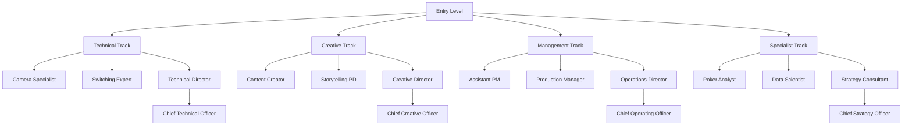

# 🚀 GG Production 혁신 교육 & 커리어 개발 가이드
## "From Local PD to Global Poker Production Leader"

---

## 🌟 혁신적 교육 프로그램

### 🎮 **1. 게이미피케이션 학습 시스템**

#### **"GGP Academy Quest"**
```javascript
const learningQuests = {
  novice: {
    quests: [
      {
        name: "First Hand",
        objective: "포커 핸드 100개 분석",
        reward: "Novice Badge",
        xp: 100
      },
      {
        name: "Camera Master",
        objective: "FR7 카메라 셋업 완료",
        reward: "Tech Points +50",
        xp: 150
      }
    ]
  },

  intermediate: {
    quests: [
      {
        name: "Bubble Hunter",
        objective: "버블 상황 5회 성공 연출",
        reward: "Intermediate Badge",
        xp: 500
      },
      {
        name: "Story Creator",
        objective: "하이라이트 영상 10개 제작",
        reward: "Creative Points +100",
        xp: 750
      }
    ]
  },

  expert: {
    quests: [
      {
        name: "Final Table Director",
        objective: "파이널 테이블 독립 운영",
        reward: "Expert Badge + 해외 파견 기회",
        xp: 2000
      }
    ]
  }
};
```

#### **레벨 시스템 & 보상**
```
Level 1-10: Rookie
├─ 기본 교육 이수
├─ 월급 100%
└─ 국내 이벤트만

Level 11-30: Professional
├─ 독립 운영 가능
├─ 월급 120% + 성과급
└─ 아시아 이벤트 참여

Level 31-50: Expert
├─ 멘토링 자격
├─ 월급 150% + 스톡옵션
└─ 글로벌 이벤트 리더

Level 51+: Master
├─ 프로젝트 결정권
├─ 월급 200% + 파트너십
└─ WSOP 메인 PD 후보
```

---

### 🤖 **2. AI 멘토 시스템**

#### **"GGP AI Coach"**
```python
class AIPokerProductionMentor:
    def __init__(self, user_profile):
        self.user = user_profile
        self.learning_path = self.generate_path()

    def daily_coaching(self):
        """매일 맞춤형 코칭 제공"""
        return {
            "morning_brief": self.analyze_yesterday(),
            "skill_challenge": self.create_daily_quest(),
            "learning_content": self.recommend_content(),
            "peer_matching": self.find_study_buddy(),
            "feedback": self.realtime_feedback()
        }

    def analyze_performance(self, broadcast_data):
        """실시간 방송 분석 & 피드백"""
        metrics = {
            "camera_switching": self.analyze_cuts(),
            "story_flow": self.evaluate_narrative(),
            "crisis_handling": self.assess_response(),
            "viewer_engagement": self.measure_retention()
        }
        return self.generate_improvement_plan(metrics)

    def predict_career_path(self):
        """AI 기반 커리어 예측"""
        return {
            "current_level": self.user.level,
            "predicted_growth": "6개월 내 Senior",
            "recommended_skills": ["ICM 이해", "영어 회화"],
            "optimal_path": "Camera → PD → Lead → Director"
        }
```

---

### 🌐 **3. 메타버스 트레이닝 센터**

#### **"GGP Virtual Studio"**
```yaml
Virtual Training Environments:

1. WSOP Main Event Simulation:
   - 가상 리오 카지노
   - 5000명 플레이어 시뮬레이션
   - 실시간 위기 상황 발생
   - 멀티플레이어 협업

2. Equipment Training Room:
   - 가상 장비 조작
   - 케이블 연결 시뮬레이션
   - 트러블슈팅 연습
   - 무한 반복 가능

3. Director's Chair Experience:
   - PD 시점 체험
   - 실시간 의사결정
   - 멀티 스크린 관제
   - AI 팀원과 협업

4. Crisis Management Scenarios:
   - 랜덤 위기 발생
   - 시간 제한 해결
   - 점수화 시스템
   - 글로벌 랭킹
```

---

### 🎯 **4. 실전 프로젝트 기반 학습 (PBL)**

#### **"Real Money, Real Learning"**
```markdown
## Junior Project (Month 1-2)
**미션**: 소규모 온라인 토너먼트 방송
- 예산: $5,000
- 규모: 100명 참가
- 목표: 무사고 3시간 방송
- 보상: 성공 시 $500 보너스

## Intermediate Project (Month 3-4)
**미션**: 지역 카지노 라이브 이벤트
- 예산: $20,000
- 규모: 500명 참가
- 목표: 2일간 방송, 시청률 5000+
- 보상: 성공 시 $2000 보너스

## Advanced Project (Month 5-6)
**미션**: 국제 온라인 시리즈
- 예산: $50,000
- 규모: 10,000명 참가
- 목표: 일주일 방송, 수익 창출
- 보상: 수익의 10% 인센티브

## Expert Project (Month 7-8)
**미션**: WSOP 서브 이벤트 단독 운영
- 예산: $100,000
- 규모: 실제 WSOP 이벤트
- 목표: 글로벌 스탠다드 달성
- 보상: 정규직 전환 + 해외 정착 지원
```

---

## 📈 커리어 개발 로드맵

### **Career Tracks**



### **연차별 성장 경로**

#### **Year 1: Foundation**
```python
year_1_milestones = {
    "Q1": {
        "focus": "기초 역량 구축",
        "skills": ["포커 룰", "기본 장비", "팀워크"],
        "certification": "GGP Basic Certificate",
        "salary": "₩40,000,000"
    },
    "Q2": {
        "focus": "실전 경험 축적",
        "skills": ["라이브 운영", "위기 대응"],
        "certification": "RFID System Expert",
        "salary": "₩42,000,000"
    },
    "Q3": {
        "focus": "전문성 개발",
        "skills": ["스토리텔링", "데이터 분석"],
        "project": "독립 프로젝트 1회",
        "salary": "₩45,000,000"
    },
    "Q4": {
        "focus": "리더십 준비",
        "skills": ["팀 관리", "의사결정"],
        "achievement": "올해의 신인상",
        "salary": "₩48,000,000"
    }
}
```

#### **Year 2-3: Growth**
```yaml
Development Path:
  Year 2:
    Position: Senior Producer
    Responsibilities:
      - 중형 이벤트 리드
      - 신입 멘토링
      - 혁신 프로젝트 참여
    Salary Range: ₩55,000,000 - ₩65,000,000
    International Events: 3-4회/년

  Year 3:
    Position: Lead Producer
    Responsibilities:
      - 대형 이벤트 총괄
      - 팀 빌딩 & 관리
      - 전략 수립 참여
    Salary Range: ₩70,000,000 - ₩85,000,000
    Stock Options: Available
```

#### **Year 4-5: Leadership**
```javascript
const leadershipPhase = {
  year4: {
    role: "Production Director",
    team: "15-20명",
    budget: "$5M+",
    events: "WSOP, EPT 등 메이저",
    compensation: {
      base: "₩90,000,000",
      bonus: "30-50%",
      equity: "0.1-0.5%"
    }
  },

  year5: {
    role: "VP of Production",
    scope: "Global Operations",
    strategic: "사업 개발 참여",
    innovation: "신규 서비스 런칭",
    compensation: {
      base: "₩120,000,000",
      bonus: "50-100%",
      equity: "0.5-1%"
    }
  }
};
```

---

## 🌍 글로벌 커리어 기회

### **International Rotation Program**
```
🇺🇸 Las Vegas (6 months)
└─ WSOP 메인 시즌
└─ 미국 방송 문화 학습
└─ 네트워킹 구축

🇪🇺 Barcelona (3 months)
└─ EPT 시리즈
└─ 유럽 스타일 학습
└─ 다국어 방송 경험

🇲🇴 Macau (3 months)
└─ 아시아 하이롤러
└─ 중화권 시장 이해
└─ 24/7 카지노 문화

🌐 Remote (Ongoing)
└─ 온라인 시리즈
└─ 글로벌 팀 협업
└─ 시차 관리 능력
```

### **Global Certification Program**
```yaml
certifications:
  technical:
    - Broadcast Engineering Certificate
    - IP Production Specialist
    - Cloud Streaming Expert
    - 8K/HDR Production

  poker_specific:
    - Tournament Director Assistant
    - Poker Dealer License
    - Game Integrity Officer
    - Anti-Collusion Specialist

  business:
    - Project Management (PMP)
    - Agile/Scrum Master
    - Data Analytics
    - Digital Marketing

  languages:
    - English: Business Level
    - Chinese: Conversational
    - Spanish: Basic
```

---

## 💼 특별 커리어 프로그램

### **1. Entrepreneurship Program**
```markdown
## "Spin-off Your Idea"

지원 내용:
- Seed Money: $50,000
- 6개월 Incubation
- 멘토링 & 네트워킹
- GGP 인프라 활용

성공 사례:
- AI Commentary System → $2M Exit
- NFT Highlights Platform → 운영 중
- VR Poker Training → Series A
```

### **2. Industry Exchange Program**
```python
exchange_partners = {
    "ESPN": {
        "duration": "3 months",
        "focus": "Sports Broadcasting",
        "location": "Connecticut, USA"
    },
    "Sky Sports": {
        "duration": "2 months",
        "focus": "Live Production",
        "location": "London, UK"
    },
    "Riot Games": {
        "duration": "3 months",
        "focus": "Esports Production",
        "location": "Los Angeles, USA"
    },
    "Netflix": {
        "duration": "6 months",
        "focus": "Content Strategy",
        "location": "Los Gatos, USA"
    }
}
```

### **3. Academic Partnership**
```yaml
Partner Universities:

USC School of Cinematic Arts:
  - Summer Program
  - Advanced Production Techniques
  - Hollywood Networking

UNLV Gaming Studies:
  - Poker Mathematics
  - Casino Operations
  - Gaming Law

Seoul Institute of the Arts:
  - K-Content Production
  - Digital Media Arts
  - Creative Technology
```

---

## 🏆 성과 보상 시스템

### **Performance Metrics & Rewards**
```javascript
const performanceSystem = {
  metrics: {
    technical: {
      weight: 30,
      kpis: ["무사고율", "장비 효율", "문제 해결"]
    },
    creative: {
      weight: 25,
      kpis: ["시청률", "참여도", "혁신성"]
    },
    teamwork: {
      weight: 25,
      kpis: ["협업", "멘토링", "커뮤니케이션"]
    },
    growth: {
      weight: 20,
      kpis: ["학습", "자격증", "프로젝트"]
    }
  },

  rewards: {
    quarterly: {
      top10: "상금 ₩5,000,000",
      top30: "상금 ₩2,000,000",
      top50: "상금 ₩1,000,000"
    },
    annual: {
      mvp: "WSOP 메인 이벤트 패키지",
      innovation: "스타트업 지원금",
      teamPlayer: "팀 여행 상품권"
    }
  }
};
```

---

## 🔮 미래 커리어 비전

### **2025-2030 Emerging Roles**
```markdown
## New Positions

### 1. Metaverse Production Director
- 가상 공간 포커 이벤트 기획
- Avatar 기반 방송 연출
- NFT 통합 콘텐츠 제작
- 예상 연봉: ₩150,000,000+

### 2. AI Production Specialist
- 자동화 시스템 구축
- AI 해설 시스템 관리
- 예측 분석 모델 개발
- 예상 연봉: ₩130,000,000+

### 3. Web3 Content Strategist
- 블록체인 기반 콘텐츠
- DAO 커뮤니티 운영
- 토큰 이코노미 설계
- 예상 연봉: ₩140,000,000+

### 4. Holographic Show Producer
- 홀로그램 라이브 쇼
- AR/VR 통합 경험
- 5G 스트리밍 최적화
- 예상 연봉: ₩160,000,000+
```

---

## 📱 커리어 지원 플랫폼

### **"MyGGPCareer" App**
```javascript
const careerApp = {
  features: {
    dashboard: {
      currentLevel: "실시간 레벨 표시",
      nextMilestone: "다음 목표까지 진행률",
      earnings: "누적 수입 & 예상 수입",
      achievements: "획득한 뱃지 & 인증"
    },

    learning: {
      courses: "맞춤형 교육 추천",
      mentors: "멘토 매칭 시스템",
      library: "학습 자료 라이브러리",
      quiz: "일일 퀴즈 & 챌린지"
    },

    networking: {
      colleagues: "동료 프로필",
      alumni: "선배 네트워크",
      global: "해외 팀 연결",
      events: "네트워킹 이벤트"
    },

    opportunities: {
      internal: "사내 공고",
      projects: "프로젝트 기회",
      overseas: "해외 파견",
      entrepreneurship: "창업 지원"
    }
  }
};
```

---

## 🎓 평생 교육 지원

### **Continuous Learning Benefits**
```yaml
Annual Education Budget:
  Junior: ₩3,000,000
  Senior: ₩5,000,000
  Lead: ₩8,000,000
  Director: ₩12,000,000

Covered Programs:
  - 학위 과정 (석사/박사)
  - 전문 자격증
  - 온라인 코스 (Coursera, Udemy)
  - 컨퍼런스 참가
  - 어학 교육
  - 코칭/멘토링

Special Support:
  - 학습 휴가 (연 10일)
  - 도서 구입 무제한
  - 장비 지원 (노트북, 태블릿)
  - 스터디 그룹 지원금
```

---

## 🌟 성공 스토리

### **Alumni Success Stories**
```markdown
## John.Lee (2020 입사 → 2024 현재)

Journey:
- 2020: Camera Assistant
- 2021: Junior PD
- 2022: WSOP 파견
- 2023: Senior PD & 혁신상
- 2024: Production Director

Achievements:
- 시청률 300% 성장 주도
- AI 카메라 시스템 개발
- 5개국어 방송 시스템 구축
- 현 연봉: ₩120,000,000

Quote:
"GGP는 단순한 직장이 아니라
 글로벌 커리어의 발사대입니다."
```

---

## 🚀 Your Future Starts Here

### **Next Steps**
1. **지원하기**: career@ggproduction.com
2. **상담 예약**: 온라인 커리어 상담
3. **체험하기**: 1일 인턴십 프로그램
4. **네트워킹**: 월간 오픈 하우스

### **Why GG Production?**
```
✓ 글로벌 커리어 보장
✓ 업계 최고 대우
✓ 지속적 성장 기회
✓ 혁신적 문화
✓ 워라밸 존중
```

---

> **"우리는 방송을 만드는 것이 아니라,
> 미래의 엔터테인먼트를 창조합니다."**
>
> *Join us and shape the future of poker entertainment!*
>
> **- GG Production Career Development Team** 🎰🚀