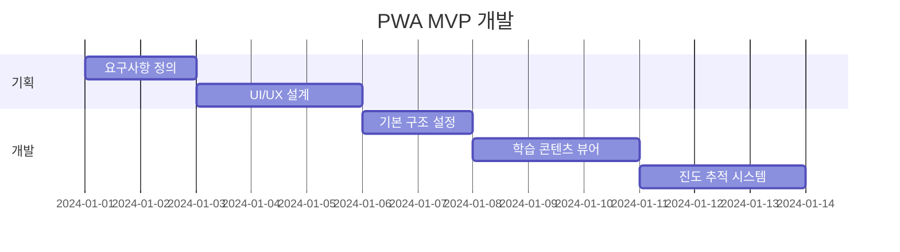

# 📱 GG Production 교육 플랫폼 개발 기획서
## "Progressive Web App 기반 자기주도 학습 시스템"

---

## 🎯 배포 방식 비교 분석

### **배포 방식 평가 매트릭스**

| 평가 항목 | 문서(PDF) | 네이티브 앱 | 웹사이트 | **PWA** | LMS |
|---|:---:|:---:|:---:|:---:|:---:|
| **개발 비용** | ⭐⭐⭐⭐⭐ | ⭐ | ⭐⭐⭐ | ⭐⭐⭐⭐ | ⭐⭐ |
| **유지보수** | ⭐⭐⭐⭐⭐ | ⭐⭐ | ⭐⭐⭐ | ⭐⭐⭐⭐ | ⭐⭐⭐ |
| **접근성** | ⭐⭐⭐ | ⭐⭐⭐ | ⭐⭐⭐⭐⭐ | ⭐⭐⭐⭐⭐ | ⭐⭐⭐ |
| **오프라인 사용** | ⭐⭐⭐⭐⭐ | ⭐⭐⭐⭐ | ⭐ | ⭐⭐⭐⭐ | ⭐⭐ |
| **진도 추적** | ⭐ | ⭐⭐⭐⭐⭐ | ⭐⭐⭐ | ⭐⭐⭐⭐⭐ | ⭐⭐⭐⭐⭐ |
| **상호작용** | ⭐ | ⭐⭐⭐⭐⭐ | ⭐⭐⭐⭐ | ⭐⭐⭐⭐ | ⭐⭐⭐⭐ |
| **업데이트 용이성** | ⭐⭐ | ⭐⭐ | ⭐⭐⭐⭐⭐ | ⭐⭐⭐⭐⭐ | ⭐⭐⭐⭐ |
| **크로스 플랫폼** | ⭐⭐⭐ | ⭐⭐ | ⭐⭐⭐⭐⭐ | ⭐⭐⭐⭐⭐ | ⭐⭐⭐⭐ |
| **총점** | 22/40 | 26/40 | 31/40 | **38/40** | 30/40 |

### ✅ **최종 선택: Progressive Web App (PWA)**

**선택 이유:**
1. 웹과 앱의 장점을 모두 활용
2. 설치 없이 즉시 사용 가능
3. 오프라인에서도 완벽 작동
4. 자동 업데이트로 항상 최신 버전
5. 모든 디바이스에서 동일한 경험
6. 개발 및 유지보수 비용 효율적

---

## 🏗️ PWA 개발 기획

### **프로젝트 개요**
```yaml
프로젝트명: GGP Academy PWA
목적: 20일 집중 포커 프로덕션 교육 플랫폼
타겟: 프로덕션 경력자 대상 포커 전문 교육
기간: 개발 4주 + 테스트 2주
예산: 약 3,000만원
```

### **핵심 기능 요구사항**

#### 1. **학습 관리 시스템**
```javascript
const learningFeatures = {
  dailyContent: {
    documents: "일일 30-50페이지 문서",
    videos: "보조 영상 자료",
    checkLists: "체크리스트 템플릿",
    tests: "일일 테스트 30문항"
  },

  progressTracking: {
    dailyProgress: "시간별 진도 체크",
    weeklyMilestones: "주간 마일스톤",
    overallCompletion: "전체 진도율",
    achievements: "성취 배지 시스템"
  },

  assessment: {
    selfEvaluation: "자가 평가",
    autoGrading: "자동 채점",
    feedbackSystem: "즉시 피드백",
    certificateGeneration: "수료증 발급"
  }
};
```

#### 2. **오프라인 기능**
```javascript
const offlineCapabilities = {
  serviceWorker: "백그라운드 동기화",
  localStorage: "진도 데이터 저장",
  indexedDB: "문서/미디어 캐싱",
  syncAPI: "온라인 복귀시 자동 동기화"
};
```

#### 3. **사용자 경험 (UX)**
```javascript
const uxFeatures = {
  responsive: "모든 디바이스 최적화",
  darkMode: "다크모드 지원",
  accessibility: "접근성 준수 (WCAG 2.1)",
  multiLanguage: "한/영 언어 전환"
};
```

---

## 💻 기술 스택

### **Frontend**
```yaml
Framework: React 18 + TypeScript
State Management: Zustand
Styling: Tailwind CSS + Shadcn/ui
Build Tool: Vite
PWA: Workbox
Testing: Jest + React Testing Library
```

### **Backend**
```yaml
Runtime: Node.js 20 LTS
Framework: NestJS
Database: PostgreSQL + Redis
ORM: Prisma
Authentication: JWT + Refresh Token
File Storage: AWS S3
```

### **DevOps**
```yaml
Hosting: Vercel (Frontend) + AWS EC2 (Backend)
CI/CD: GitHub Actions
Monitoring: Sentry + Google Analytics
CDN: CloudFront
SSL: Let's Encrypt
```

---

## 📱 주요 화면 설계

### **1. 대시보드 (홈)**
```
┌─────────────────────────────────┐
│  🎯 Day 7/20 - Week 2           │
│                                 │
│  오늘의 학습                     │
│  ┌──────────────────────┐      │
│  │ ▶ 09:00 멀티테이블    │ ✓   │
│  │ ▶ 10:00 테이블 브레이크│ ⏸   │
│  │ ▶ 11:00 피처 테이블   │     │
│  └──────────────────────┘      │
│                                 │
│  진도율: ████████░░ 75%         │
│                                 │
│  [오늘의 테스트] [체크리스트]    │
└─────────────────────────────────┘
```

### **2. 학습 콘텐츠 뷰어**
```
┌─────────────────────────────────┐
│  < Day 7 - 멀티 테이블 운영      │
│  ─────────────────────────      │
│                                 │
│  📖 페이지 12/40                │
│                                 │
│  멀티 테이블 토너먼트는...       │
│  ...                            │
│  ...                            │
│                                 │
│  [북마크] [노트] [하이라이트]    │
│                                 │
│  < 이전 | 다음 >                │
└─────────────────────────────────┘
```

### **3. 테스트 & 평가**
```
┌─────────────────────────────────┐
│  📝 Day 7 테스트 (30문항)        │
│  ─────────────────────────      │
│                                 │
│  Q12. 테이블 브레이크 시점은?    │
│                                 │
│  ○ 10명 남았을 때               │
│  ● 9명 남았을 때                │
│  ○ 8명 남았을 때                │
│  ○ 7명 남았을 때                │
│                                 │
│  12/30  시간: 18:42             │
│                                 │
│  [이전] [다음] [제출]            │
└─────────────────────────────────┘
```

### **4. 진도 관리**
```
┌─────────────────────────────────┐
│  📊 나의 학습 현황               │
│  ─────────────────────────      │
│                                 │
│  Week 1: ████████████ 100% ✓   │
│  Week 2: ████████░░░░ 65%  🔄   │
│  Week 3: ░░░░░░░░░░░░ 0%   🔒   │
│  Week 4: ░░░░░░░░░░░░ 0%   🔒   │
│                                 │
│  총 학습 시간: 48h 32m          │
│  평균 점수: 87.5%               │
│                                 │
│  [상세 리포트] [수료증 미리보기]  │
└─────────────────────────────────┘
```

---

## 🔄 개발 로드맵

### **Phase 1: MVP (2주)**


### **Phase 2: 핵심 기능 (1주)**
```
- 테스트 시스템 구현
- 체크리스트 기능
- 오프라인 모드
- 자동 동기화
```

### **Phase 3: 고급 기능 (1주)**
```
- 시뮬레이션 모듈
- 포트폴리오 생성
- 수료증 발급
- 분석 대시보드
```

### **Phase 4: 테스트 & 배포 (2주)**
```
- Alpha 테스트 (내부)
- Beta 테스트 (10명)
- 버그 수정
- 프로덕션 배포
```

---

## 💾 데이터 구조

### **Database Schema**
```sql
-- 사용자 테이블
CREATE TABLE users (
  id UUID PRIMARY KEY,
  email VARCHAR(255) UNIQUE,
  name VARCHAR(100),
  start_date DATE,
  completion_date DATE,
  created_at TIMESTAMP
);

-- 학습 진도 테이블
CREATE TABLE progress (
  id UUID PRIMARY KEY,
  user_id UUID REFERENCES users(id),
  day INTEGER,
  hour INTEGER,
  content_id VARCHAR(100),
  completed BOOLEAN DEFAULT false,
  completed_at TIMESTAMP,
  time_spent INTEGER -- 초 단위
);

-- 테스트 결과 테이블
CREATE TABLE test_results (
  id UUID PRIMARY KEY,
  user_id UUID REFERENCES users(id),
  day INTEGER,
  score INTEGER,
  total_questions INTEGER,
  submitted_at TIMESTAMP,
  answers JSONB
);

-- 체크리스트 테이블
CREATE TABLE checklists (
  id UUID PRIMARY KEY,
  user_id UUID REFERENCES users(id),
  day INTEGER,
  checklist_type VARCHAR(50),
  items JSONB,
  completed_items JSONB,
  updated_at TIMESTAMP
);
```

---

## 🔐 보안 & 개인정보

### **보안 요구사항**
```yaml
Authentication:
  - JWT 기반 인증
  - Refresh Token 구현
  - 세션 타임아웃 (30분)

Data Protection:
  - HTTPS 전용
  - 민감 데이터 암호화
  - SQL Injection 방지
  - XSS/CSRF 보호

Privacy:
  - GDPR 준수
  - 개인정보 최소 수집
  - 데이터 보관 기간 명시
  - 삭제 요청 처리
```

---

## 📈 성공 지표 (KPI)

### **기술적 KPI**
```yaml
Performance:
  - 초기 로딩: < 3초
  - 페이지 전환: < 1초
  - Lighthouse 점수: > 90

Reliability:
  - 가동률: > 99.9%
  - 오류율: < 0.1%
  - 오프라인 복구: 100%
```

### **사용자 KPI**
```yaml
Engagement:
  - 일일 활성 사용자: > 80%
  - 평균 세션 시간: > 45분
  - 완주율: > 70%

Satisfaction:
  - NPS 점수: > 8.0
  - 앱스토어 평점: > 4.5
  - 재등록률: > 60%
```

---

## 💰 예산 계획

### **개발 비용**
| 항목 | 인력 | 기간 | 비용 |
|---|---|---|---:|
| **기획/설계** | PM 1명 | 2주 | 400만원 |
| **프론트엔드** | 개발자 2명 | 4주 | 1,600만원 |
| **백엔드** | 개발자 1명 | 4주 | 800만원 |
| **디자인** | 디자이너 1명 | 2주 | 400만원 |
| **QA** | 테스터 1명 | 2주 | 300만원 |
| **총 개발비** | | | **3,500만원** |

### **운영 비용 (월)**
| 항목 | 내용 | 비용 |
|---|---|---:|
| **서버** | AWS EC2 + RDS | 30만원 |
| **CDN** | CloudFront | 10만원 |
| **스토리지** | S3 | 5만원 |
| **모니터링** | Sentry + GA | 5만원 |
| **총 운영비** | | **50만원/월** |

---

## 🚀 배포 전략

### **단계별 출시 계획**
```
1. Soft Launch (2주)
   - 내부 직원 20명 대상
   - 피드백 수집 및 개선

2. Beta Launch (4주)
   - 선발된 100명 대상
   - A/B 테스트 진행
   - 버그 수정

3. Public Launch
   - 전체 오픈
   - 마케팅 캠페인
   - 지속적 업데이트
```

### **마케팅 채널**
- 회사 홈페이지 공지
- 이메일 뉴스레터
- 링크드인 광고
- 포커 커뮤니티 홍보

---

## 📋 리스크 관리

### **기술적 리스크**
| 리스크 | 영향도 | 대응 방안 |
|---|---|---|
| **브라우저 호환성** | 중 | 주요 브라우저 테스트 |
| **오프라인 동기화 실패** | 높음 | 로컬 백업 + 재시도 로직 |
| **성능 저하** | 중 | CDN 활용 + 코드 최적화 |

### **비즈니스 리스크**
| 리스크 | 영향도 | 대응 방안 |
|---|---|---|
| **낮은 완주율** | 높음 | 게이미피케이션 강화 |
| **콘텐츠 업데이트 지연** | 중 | CMS 시스템 구축 |
| **사용자 이탈** | 높음 | 푸시 알림 + 리마인더 |

---

## 🎯 차별화 포인트

### **PWA의 독특한 장점**
1. **설치 유도 배너**: 홈 화면 추가 유도
2. **푸시 알림**: 학습 리마인더
3. **백그라운드 동기화**: 진도 자동 저장
4. **앱 같은 경험**: 전체 화면 모드
5. **빠른 로딩**: 서비스 워커 캐싱

### **경쟁 우위**
```
일반 LMS 대비:
✓ 오프라인 완벽 지원
✓ 설치 불필요
✓ 즉시 업데이트
✓ 크로스 플랫폼
✓ 저렴한 운영비
```

---

## 📝 결론 및 권고사항

### **PWA 선택의 당위성**
1. **비용 효율성**: 단일 코드베이스로 모든 플랫폼 지원
2. **빠른 개발**: 6주 내 전체 시스템 구축 가능
3. **유연한 업데이트**: 즉시 반영되는 콘텐츠 수정
4. **뛰어난 UX**: 앱과 동일한 사용자 경험
5. **미래 지향적**: 웹 표준 기술 활용

### **즉시 실행 사항**
```
Week 1: 요구사항 확정 & 디자인 시작
Week 2-5: 개발 진행
Week 6: 테스트 및 배포
```

### **성공 요인**
- 직관적인 UI/UX 설계
- 안정적인 오프라인 기능
- 빠른 피드백 반영
- 지속적인 콘텐츠 업데이트

---

> "Progressive Web App은 GG Production의
> 교육 혁신을 위한 최적의 기술 선택입니다.
> 웹의 접근성과 앱의 기능성을 모두 제공하여
> 학습자에게 최상의 교육 경험을 선사합니다."
>
> *- GG Production Digital Innovation Team*